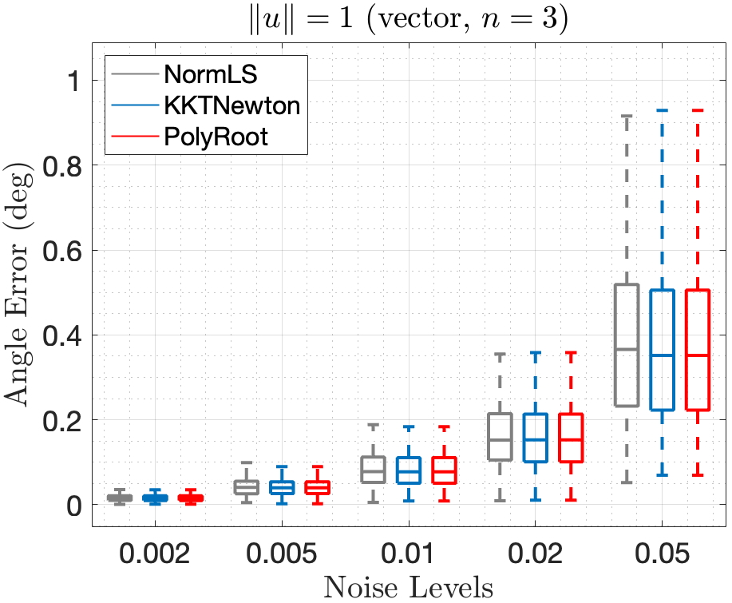
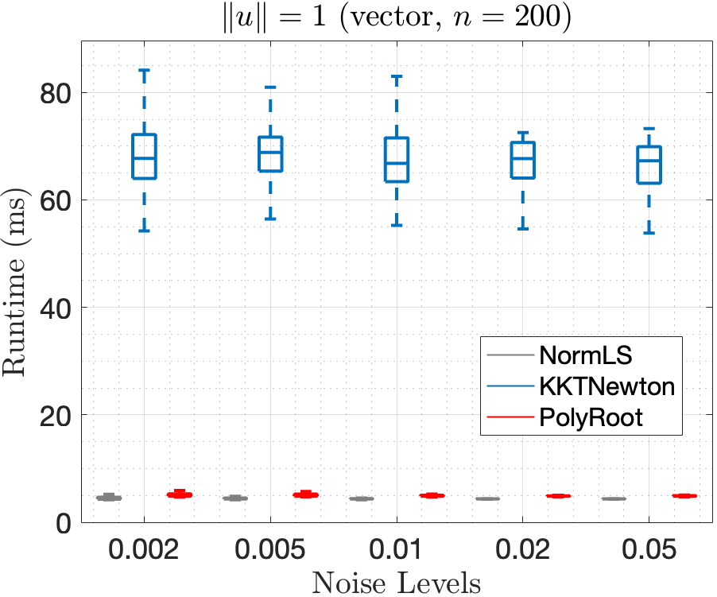
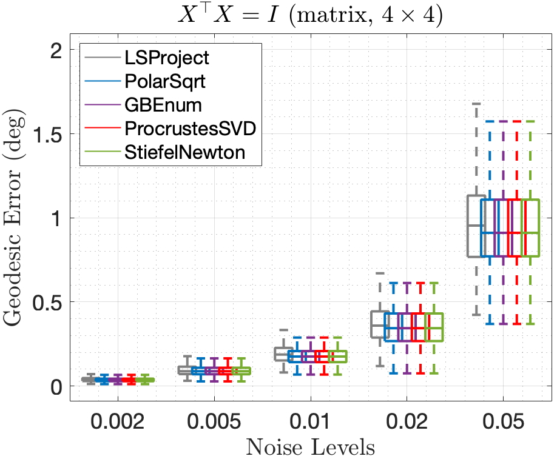
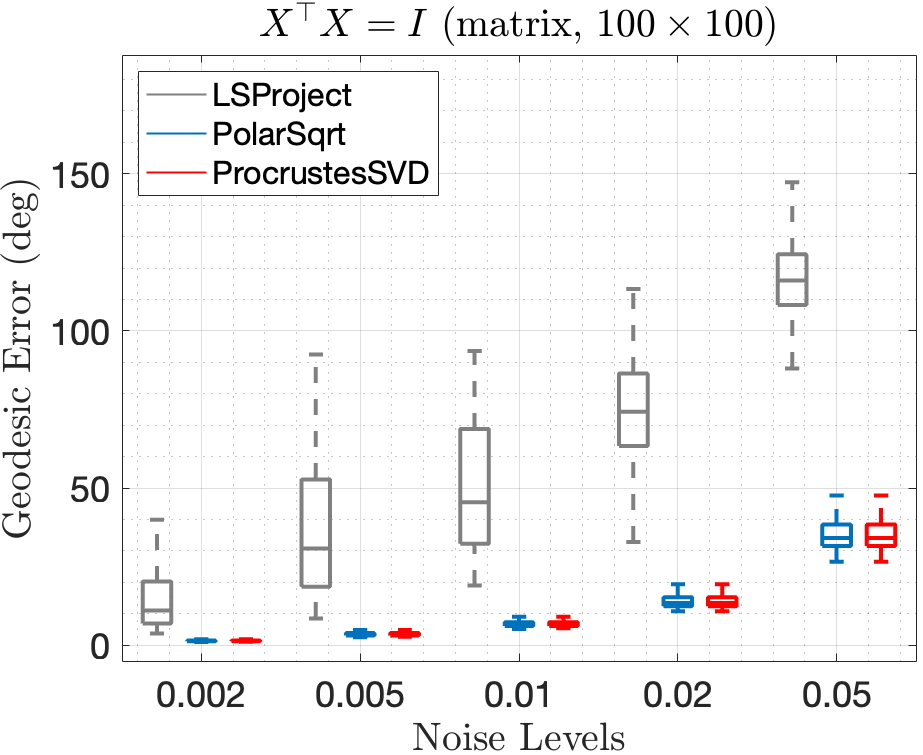
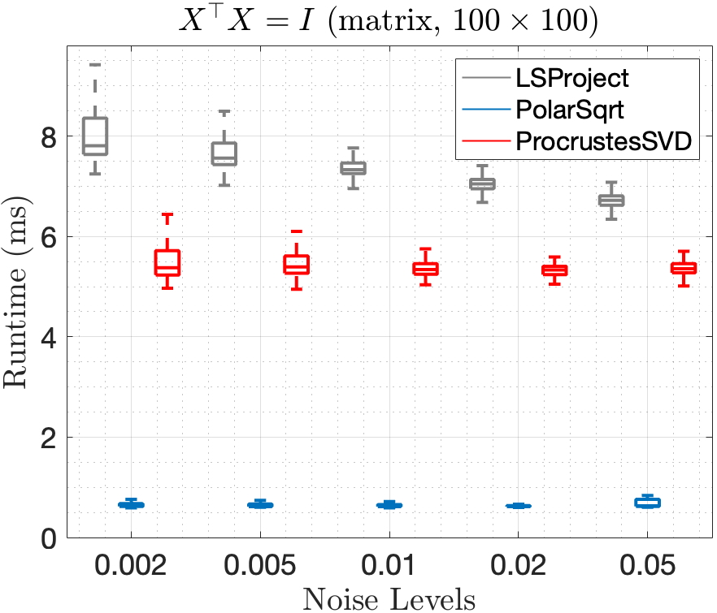
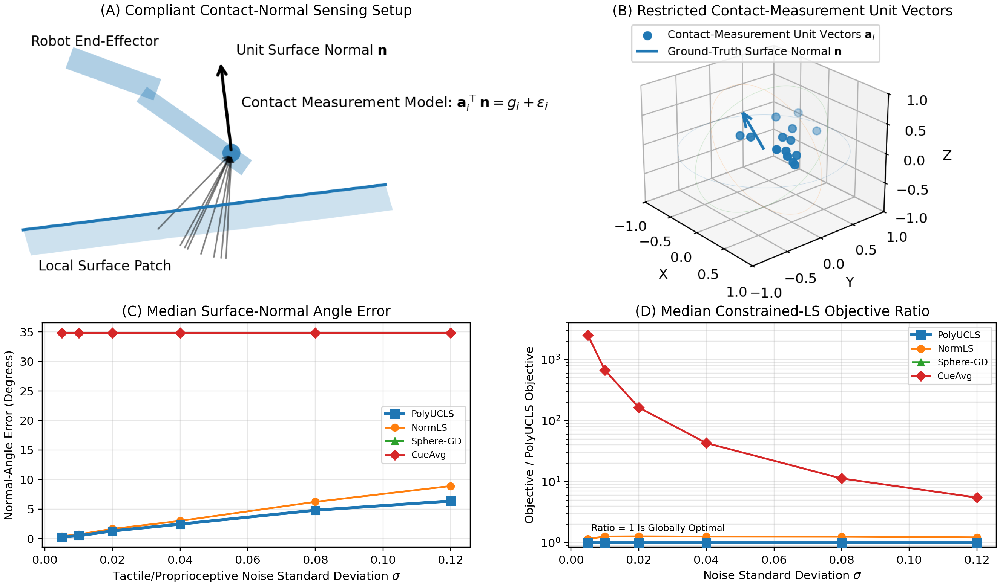
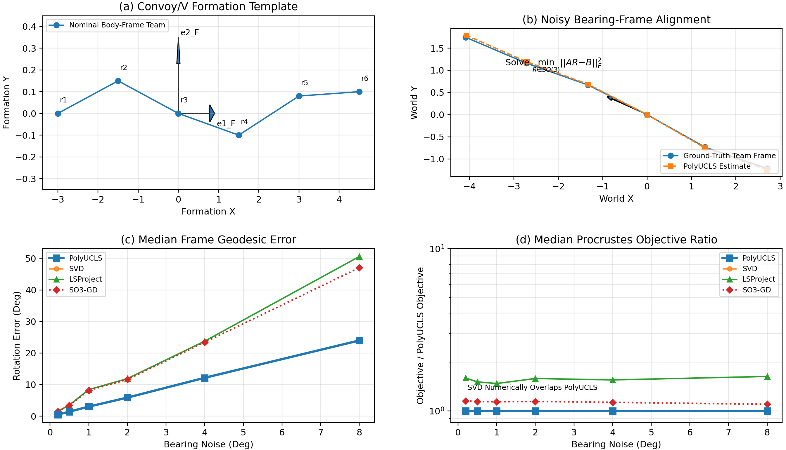
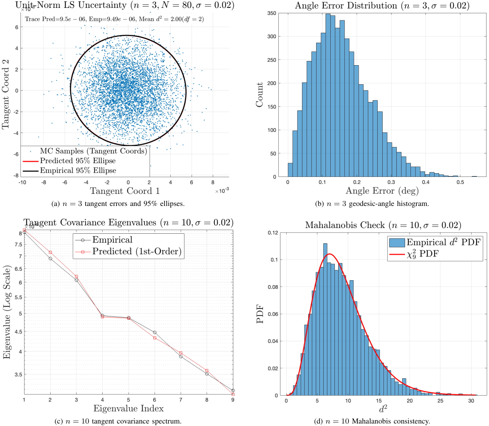
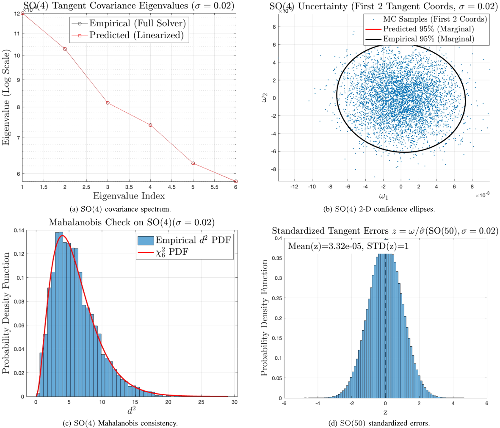

# PolyUCLS: Polynomialized Unit-Constraint Least Squares

Authors: Jin Wu, Zhijie Liu, Liang Sun, Yao Zou, Chengxi Zhang, Choon Ki Ahn, Wei He

[](https://isocpp.org/)
[](https://cmake.org/)
[](https://eigen.tuxfamily.org/)
[](https://github.com/zarathustr/PolyUCLS/stargazers)
[](https://github.com/zarathustr/PolyUCLS/issues)

---

## Introduction

This repository provides a compact C++17 reference implementation for **Polynomialized Unit-Constraint Least Squares (PolyUCLS)**. It targets least-squares problems whose unknowns must remain on a unit sphere, an orthogonal/unitary group, or a Stiefel manifold. These kernels appear in attitude determination, rigid registration, hand-eye style calibration, compliant contact estimation, and cooperative robot-frame alignment.

The core idea is to solve the constrained problem itself instead of first solving an unconstrained least-squares problem and projecting afterward. For the vector case, PolyUCLS eliminates the primal variable and solves a scalar secular equation in the Lagrange multiplier; clearing denominators gives a degree-$2n$ elimination polynomial. For the square matrix case, the solver recovers the global orthogonal Procrustes solution via SVD or a polar-factor representative. For rectangular Stiefel problems, the implementation follows the KKT reduction in the paper and solves for the multiplier matrix.

### Key Features

* **Unit-norm vector LS:** solves $\min_{\|u\|=1}\|Bu-g\|_2^2$ with robust bracketing on the KKT multiplier, including singular "hard case" handling.
* **Square orthogonal/unitary LS:** solves $\min_{X^\top X=I}\|AX-B\|_F^2$ through Procrustes SVD, polar factor, and a small-dimensional polynomial multi-solution representative.
* **Rectangular Stiefel LS:** includes a Newton solver for $\min_{X^\top X=I_l}\|AX-B\|_F^2$.
* **Uncertainty hooks:** exposes Jacobian and covariance propagation helpers for the vector estimator.
* **Reproducible benchmarks:** includes Monte Carlo noise sweeps for vector and matrix cases, with CSV output for plotting.

---

## Methodology & Visuals

### 1. Unit-Constraint LS Model

PolyUCLS starts from the generalized constrained linear model

$$
\min_{X\in\mathbb{R}^{n\times l}}\|AX-B\|_F^2,\qquad X^\top X=I_l.
$$

When $l=1$, this becomes the unit-norm vector problem

$$
\min_{\|u\|=1}\|Bu-g\|_2^2.
$$

The KKT equations are

$$
(G-\lambda I)u=v,\qquad u^\top u=1,\qquad G=B^\top B,\quad v=B^\top g.
$$

After diagonalizing $G$, the unit constraint becomes a scalar equation in $\lambda$. The paper shows that the denominator-cleared form is a degree-$2n$ polynomial, while this implementation solves the equivalent monotone secular equation directly for numerical stability.

For the matrix case, expanding the Frobenius objective gives

$$
\|AX-B\|_F^2
=\mathrm{tr}(X^\top GX)-2\mathrm{tr}(X^\top V)+\mathrm{tr}(B^\top B),
\qquad G=A^\top A,\quad V=A^\top B.
$$

If $l=n$, the first trace term is constant and the problem reduces to the classical orthogonal Procrustes problem. If $l<n$, the Stiefel solver uses the multiplier equation induced by the KKT system.

### 2. Synthetic Benchmark Results

| Vector angle error, $n=3$ | Vector runtime, $n=200$ |
| --- | --- |
|  |  |

**Vector benchmark.** The angle-error panel compares the globally constrained PolyRoot solver against a normalize-after-LS baseline and direct KKT Newton iterations. The runtime panel shows that at $n=200$ the robust scalar multiplier solve stays close to the cost of the baseline normal-equation path, while KKT Newton becomes substantially slower because each iteration solves a dense shifted system.

| $\mathrm{SO}(4)$ geodesic error | $\mathrm{SO}(100)$ geodesic error | Matrix runtime, $n=100$ |
| --- | --- | --- |
|  |  |  |

**Matrix benchmark.** The Procrustes representatives solve the constrained objective directly and remain stable as noise increases. The LSProject baseline first solves the unconstrained problem and then projects to $\mathrm{SO}(n)$; the high-dimensional panel shows why that is not equivalent to optimizing the constrained objective. The polar-factor implementation is the fastest representative in the reported $n=100$ benchmark.

### 3. Robotics Application Examples

<p align="center">
  
</p>

**Compliant contact-normal sensing.** The unknown surface normal is a unit vector on $\mathbb{S}^2$. Contact cues are restricted by the end-effector approach cone, so the measurement geometry is anisotropic. In the paper experiment, PolyUCLS reduces the median normal-angle error and objective value relative to normalizing an unconstrained LS estimate, which is the behavior desired before passing normals into impedance, admittance, or QP controllers.

<p align="center">
  
</p>

**Formation-frame estimation.** A robot team estimates a common formation frame from noisy relative-direction cues. The problem is a square $\mathrm{SO}(3)$ Procrustes instance, so PolyUCLS and SVD compute the same global constrained optimum. The comparison with LSProject highlights the main practical lesson: post-projection can be feasible but still suboptimal for ill-conditioned formation geometry.

### 4. Uncertainty Characterization

| Vector estimator uncertainty | Matrix estimator uncertainty |
| --- | --- |
|  |  |

**Uncertainty diagnostics.** The vector panels validate tangent-space covariance propagation with Monte Carlo samples, confidence ellipses, covariance spectra, and Mahalanobis consistency checks. The matrix panels show the same idea on $\mathrm{SO}(4)$ and a standardized high-dimensional check on $\mathrm{SO}(50)$. These figures are useful when PolyUCLS is embedded inside filters, batch estimators, or sensor-fusion modules that need covariance weights rather than only point estimates.

---

## Prerequisites

The code has been tested on macOS and Linux.

* **C++ standard:** C++17
* **Build system:** CMake 3.16+
* **Linear algebra:** Eigen3 3.3+

If Eigen is not installed locally, CMake can fetch Eigen 3.4.0 automatically when `GUC_LS_FETCH_EIGEN=ON` is used.

---

## C++ Build & Run

### 1. Clone

```bash
git clone https://github.com/zarathustr/PolyUCLS.git
cd PolyUCLS
```

### 2. Build

```bash
cmake -S . -B build -DCMAKE_BUILD_TYPE=Release
cmake --build build -j
```

To require a system Eigen installation and disable network fetching:

```bash
cmake -S . -B build -DCMAKE_BUILD_TYPE=Release -DGUC_LS_FETCH_EIGEN=OFF
cmake --build build -j
```

### 3. Run Examples

```bash
./build/example_unitnorm
./build/example_procrustes
./build/example_stiefel
```

---

## Benchmark

Build the benchmark executable and run a Monte Carlo sweep:

```bash
cmake -S . -B build -DCMAKE_BUILD_TYPE=Release
cmake --build build -j

./build/benchmark_noise_sweep \
  --problem unitnorm,procrustes \
  --mc 200 \
  --noise 0,0.002,0.005,0.01,0.02 \
  --out build/guc_ls_noise_sweep.csv
```

Default dimensions:

* Vector unit-norm cases: `unitnorm3`, `unitnorm50`, `unitnorm200`
* Matrix Procrustes cases: `procrustes4`, `procrustes30`, `procrustes100`

Useful overrides:

```bash
./build/benchmark_noise_sweep --unit_n 3,10,100
./build/benchmark_noise_sweep --proc_n 4,20
./build/benchmark_noise_sweep --problem unitnorm
./build/benchmark_noise_sweep --problem procrustes
```

The CSV columns are:

```text
problem,solver,noise,trial,rot_err_deg,trans_err,orth_err
```

For `unitnorm*`, `rot_err_deg` is the angle error between the true and estimated unit vector, `trans_err` is $\|Bu-g\|_2^2$, and `orth_err` is $|u^\top u-1|$. For `procrustes*`, `rot_err_deg` is the geodesic distance on $\mathrm{SO}(n)$, `trans_err` is $\|AX-B\|_F^2$, and `orth_err` is $\|X^\top X-I\|_F$.

---

## API Map

Core headers live in `include/guc_ls/`.

* `guc_ls/unit_norm_ls.hpp`: `solve_unit_norm_ls`, `solve_unit_norm_ls_normal`, `jacobian_u_wrt_v`, `covariance_u`
* `guc_ls/procrustes.hpp`: `procrustes_svd`, `procrustes_polar_sqrt`, `ls_then_project`, `procrustes_gb_enum`, `orthogonal_geodesic_distance_deg`
* `guc_ls/stiefel_ls.hpp`: `solve_stiefel_ls`, `solve_procrustes`
* `guc_ls/roots.hpp` and `guc_ls/polynomial.hpp`: scalar polynomial/root utilities used by the solvers

---

## Notes

* The vector solver chooses the constrained optimum by solving the secular equation and evaluating feasible candidates, rather than relying on a local Newton initialization.
* The degree-$2n$ polynomial viewpoint is valuable for theory and low-dimensional symbolic solvers; the C++ implementation favors the numerically equivalent bracketing route.
* The Stiefel-Newton solver is intended as a clear reference implementation for small or moderate column dimension $l$.
* This repository is designed to be readable and reproducible rather than fully optimized.

---

## Citation

If you find this work useful for your research, please cite:

```bibtex
@article{wu2026polyucls,
  title={Polynomialized Unit-Constraint Least Squares},
  author={Wu, Jin and Liu, Zhijie and Sun, Liang and Zou, Yao and Zhang, Chengxi and Ahn, Choon Ki and He, Wei},
  journal={Submission to IEEE Transactions on Systems, Man, and Cybernetics: Systems},
  year={2026},
  publisher={Arxiv},
  url={https://github.com/zarathustr/PolyUCLS}
}
```

---

## Issues

For questions, please open an issue or contact `wujin@ustb.edu.cn`.
